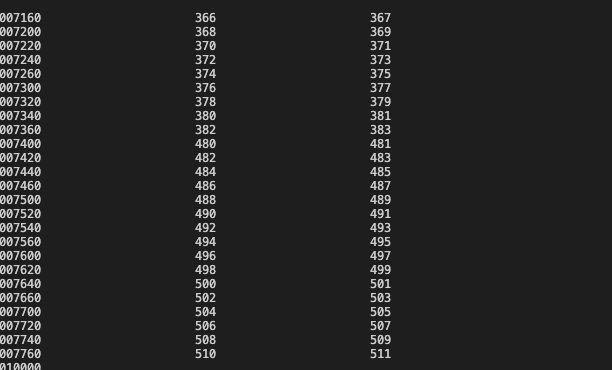
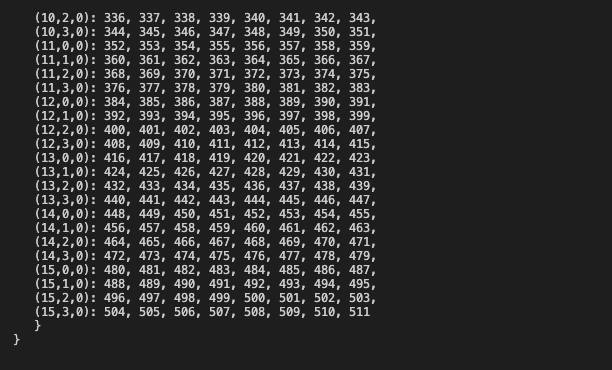
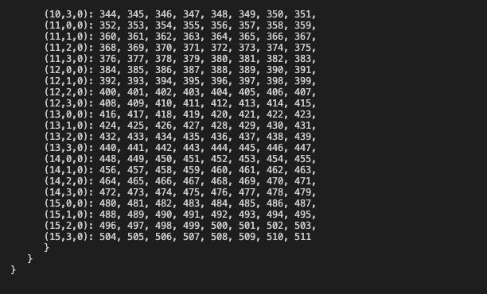
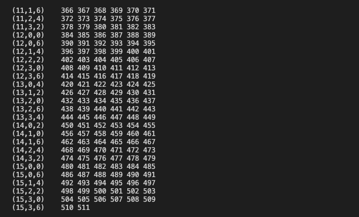
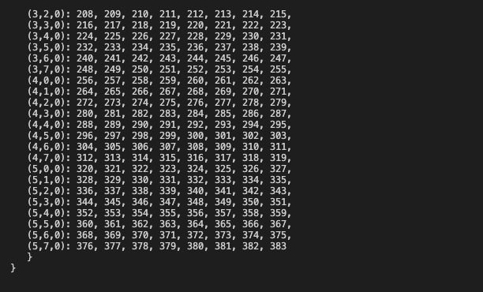

## Verification tests flag works: 
Needs to be automatic later. 
For now; 

Flag = 1, ranks 4, global aray size (2^3)^3 last number should be; 512

### MPIIO

### PHDF5

### ADIOS2_HDF5

### ADIOS2_BP4

## However, ranks 3 create problem. Need to rectify uneven numbers. 

