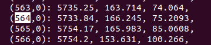
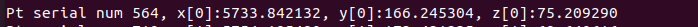

# Topology file
Dataset file name should be in triple quotes otherwise we get segmentation fault. 
```
#define FILE      "/home/shrey/coding/crescendo-wholeengine-structural-cpp/mesh/CRESCENDO_ENGINE_LTMS_order1.h5"
#define DATASET      """MeshTags/tetra marker/topology""" 
```

Topology file can be read parallel but geometry file needs to be read serially. This can be put in another function.  

```
topology mesh 
(190965,0): 266547, 266546, 264376, 264390,
iodata mesh 
(127128,0): 4274.46, -222.168, -207.912,
```
   
### Cross reference mesh data points with geometry
```
x[j] = iodata[(topology[i*DIM2+j])*DIM4]; 
y[j] = iodata[(topology[i*DIM2+j])*DIM4 + 1]; 
z[j] = iodata[(topology[i*DIM2+j])*DIM4 + 2];
``` 
From H5DUMP of mesh file:  




From topology mesh read using volume c file: 



            
### Volume of tetrahedron
 ```
 volume =    (   (x[3] - x[0]) * ( (y[1] - y[0]) * (z[2] - z[0]) -
                                (z[1] - z[0]) * (y[2] - y[0]))   + 
                (y[3] - y[0]) * ( (z[1] - z[0]) * (x[2] - x[0]) -
                                (x[1] - x[0]) * (y[2] - y[0]))    + 
                (z[3] - z[0]) * ( (x[1] - x[0]) * (y[2] - y[0]) -
                                (y[1] - y[0]) * (x[2] - x[0]))    )/6  ; 
```

Ref: https://keisan.casio.com/exec/system/1223609147

### Obtain volume calculations from every rank 
MPI gather from all ranks and compute the sum. 

But different ranks give different volumes. 


